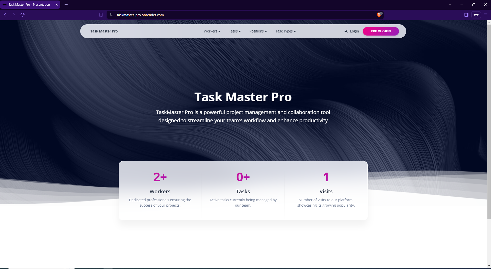

# TaskMaster Pro

TaskMaster Pro is a powerful project management and collaboration tool designed to streamline your team's workflow and enhance productivity. With features like task management, worker assignments, and task types, TaskMaster Pro is an all-in-one solution for managing your projects.

## Home Page
Below is a screenshot of the home page:



## Live Demo
You can access the live demo of TaskMaster Pro here:
[TaskMaster Pro Live Demo](https://taskmaster-pro.onrender.com/)

## Test Credentials

To explore the features of TaskMaster Pro, you can use the following test credentials:

### Admin User
- **Username:** admin
- **Password:** Adminpassword123!

### Regular User
- **Username:** specialized
- **Password:** Password123!

## Features
- Task Management: Create, update, and delete tasks with various priority levels and deadlines.
- Worker Management: Manage workers, assign them to tasks, and view their task statistics.
- Positions: Manage positions within the organization and assign workers to these positions.
- Task Types: Categorize tasks by different types for better organization.
- User Authentication: Secure login and registration system.
- Responsive Design: User-friendly interface optimized for all devices.

## DB schema


## Getting Started
### Prerequisites

Ensure you have the following installed on your local machine:

- Python 3.x
- Django 3.x or later
- pip (Python package installer)

### Installation

1. Clone the repository:

```bash
git clone https://github.com/SpecializedBaby/task-master-pro.git
cd taskmaster-pro
```

2. Create a virtual environment and activate it:

```bash
python -m venv venv
source venv/bin/activate   # On Windows, use `venv\Scripts\activate`
```

3. Install the dependencies:

```bash
pip install -r requirements.txt
```

4. Apply migrations:

```bash
python manage.py migrate
```

5. Create a superuser:

```bash
python manage.py createsuperuser
```

6. Run the development server:

```bash
python manage.py runserver
```

Visit http://127.0.0.1:8000/ in your web browser to access TaskMaster Pro.

## Environment Variables

Ensure you have a `.env` file in your project root with the following variables:

```env
DJANGO_SECRET_KEY=your_secret_key
DJANGO_DEBUG=True
DATABASE_URL=your_database_url
PYTHON_VERSION=3.11.2
WEB_CONCURRENCY=4
```

## Usage
### Navigation
- **Workers:** View the list of workers, create new workers, and manage worker details.
- **Tasks:** View all tasks, create new tasks, and manage task details.
- **Positions:** View the list of positions, create new positions, and manage position details.
- **Task Types:** Manage different categories of tasks.

### Views and Context
- **Worker Detail View:**
  - **URL: /worker/<int:pk>/**
  - **Context:**
    - **count_of_tasks:** Total tasks assigned to the worker.
    - **count_of_completed_tasks:** Completed tasks assigned to the worker.
    - **count_of_active_tasks:** Active (not completed) tasks assigned to the worker.

## Contributing
Contributions are welcome! Please fork the repository and create a pull request with your changes.

## License
This project is licensed under the MIT License. See the LICENSE file for details.

## Acknowledgments
- [Bootstrap](https://getbootstrap.com/docs/5.3/getting-started/introduction/) for the responsive design framework.
- [Django](https://www.djangoproject.com/) for the robust web framework.

## Contact
For any inquiries, please contact us at specialized8393@gmail.com


